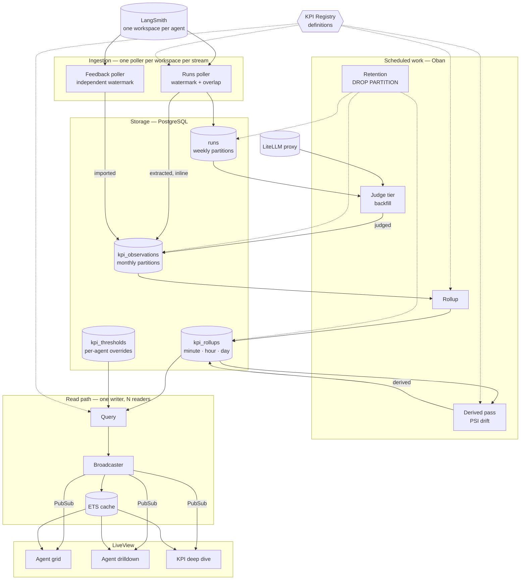
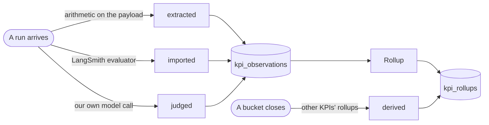

# AgentLens

An observability platform for AI agents. AgentLens reads agent telemetry from
[LangSmith](https://smith.langchain.com), computes KPIs over time, stores them in Postgres, and
renders them per-agent in a Phoenix LiveView dashboard.

## Architecture



Four things the diagram is meant to make obvious:

**The registry feeds both sides.** Ingestion, rollups, the derived pass and the read path all resolve
KPI *definitions* rather than knowing about KPI *modules*. That dotted fan-out is why adding a KPI is
one file plus one config line — none of those four layers has anything to branch on.

**Nothing user-facing reaches left of `kpi_rollups`.** LiveViews read the ETS cache; the cache is
written by one broadcaster; the broadcaster reads rollups. No page ever touches LangSmith, `runs`, or
`kpi_observations`, so load on the database and on LangSmith is independent of how many people are
looking.

**Runs and feedback are polled separately.** Feedback is written *after* the run it attaches to, so a
shared cursor would either stall run ingestion behind a slow evaluator or advance past feedback that
had not landed yet.

**The derived pass writes to `kpi_rollups`, not `kpi_observations`.** A drift value belongs to a
bucket, not to any single run — there is no run to attach it to.

## Working on this project

Design decisions here are deliberate and easy to undo by accident. Before making
changes — whether by hand or with an AI assistant — read:

- **[docs/backend-guidelines.md](docs/backend-guidelines.md)** — architecture, the KPI abstraction,
  ingestion, rollups, retention, and the invariants that keep the dashboard honest
- **[docs/frontend-guidelines.md](docs/frontend-guidelines.md)** — the design system, how good and
  bad are encoded, component and LiveView rules

[AGENTS.md](AGENTS.md) and [CLAUDE.md](CLAUDE.md) point AI assistants at both.

## Core idea: three kinds of KPI

"KPI" covers three things with very different cost profiles, and each gets its own scheduler and
backpressure story.

| Kind | Cost | Computed |
|---|---|---|
| `:extracted` | free — arithmetic on the run payload | inline during ingest, on every run |
| `:judged` | a model call, so money and seconds | sampled, asynchronous, retried |
| `:derived` | cheap, but needs other KPIs' rollups | on bucket close |

A fourth *source* (not a fourth kind) is `:imported` — scores LangSmith's own online evaluators
computed, pulled in through the feedback API. These land in the same table as judged values and
flow through the same rollup path.



Three of the four routes converge on `kpi_observations` because they describe a *run*. `derived` goes
straight to `kpi_rollups` because it describes a *bucket*, and `kpi_observations.source` is
deliberately limited to the three ways a per-run value can arise.

## Agent identity

Agent identity is the **LangSmith workspace**: each agent traces into its own workspace, so the
workspace id is the dimension every KPI slices by. One org-scoped API key covers every workspace.

## Adding a KPI

This is the extensibility seam, and it is deliberately one file plus one line.

1. Write a module implementing the `AgentLens.Kpi` behaviour.
2. Add it to the `:kpis` list under `config :agent_lens, AgentLens.Kpi.Registry` in
   `config/config.exs`.

Nothing else changes. Rollups and UI both read definitions from the registry rather than knowing
about modules, so a new KPI propagates to both without either being modified. `mix test` includes
an acceptance test that enforces this.

## Getting started

Requires Elixir 1.17+, Erlang/OTP 26+, and Docker.

```bash
docker compose up -d  # PostgreSQL 16 on port 5434
mix setup             # deps, database, assets
mix agent_lens.seed   # ~90 days of mock history, with anomalies
mix phx.server        # http://localhost:4000
```

The database runs in a container dedicated to this project, so its lifecycle and data are not
entangled with anything else you happen to be running. Connection settings are overridable with the
standard `PGHOST` / `PGPORT` / `PGUSER` / `PGPASSWORD` variables if you would rather point at your
own PostgreSQL.

`mix agent_lens.seed` backfills every configured workspace from the mock client — roughly 21,600
runs and 65,000 observations per agent. It is safe to re-run; everything upserts on its natural key.
Automatic polling is off by default so `mix test` and `mix run` stay fast; enable it with
`config :agent_lens, AgentLens.Ingestion, enabled: true`.

## Configuration

Dev and test run against a **mock LangSmith client** by default: no API key, no network. The mock
is deterministic — the same window returns identical data every time — so it doubles as the fixture
set for drift detection rather than being mere filler. It injects three findable events, exposed
symbolically via `AgentLens.LangSmith.Mock.anomalies/0`:

| Anomaly | What it looks like |
|---|---|
| Latency spike | ~1.2s → ~7s for four days, with errors rising alongside, then recovers |
| Toxicity regression | 0.02 → 0.16 at a simulated model version change, and does **not** recover |
| Cost creep | Per-run cost drifting steadily upward across the window |

The client is chosen by whether a real LangSmith is actually configured: set `LANGSMITH_API_KEY`
and it uses the HTTP client, leave it unset and it uses the mock. A deploy that has lost its
credentials therefore degrades rather than crashing — and the dashboard shows a **Mock data**
badge, because invented numbers must never be mistaken for measured ones.

| Variable | Default | Notes |
|---|---|---|
| `LANGSMITH_API_KEY` | — | present ⇒ real client; absent ⇒ mock |
| `LANGSMITH_ENDPOINT` | `https://api.smith.langchain.com` | override for self-hosted |
| `LANGSMITH_WORKSPACES` | three sample ids under the mock | comma-separated, one per agent |
| `LANGSMITH_CLIENT` | — | `http` or `mock` to override the automatic choice |
| `LITELLM_ENDPOINT` | — | present ⇒ the judge tier reaches a real model |
| `LITELLM_API_KEY` | — | bearer token for the proxy |
| `LITELLM_MODEL` | `gpt-4o-mini` | model the judge asks for |

> The HTTP client has been built and tested against stubbed responses but **never against a live
> LangSmith**. Its endpoint paths and response field names are gathered at the top of
> `AgentLens.LangSmith.HTTP` so they can be corrected in one place; see that module's docs for
> what to verify first.

## Quality gates

```bash
mix precommit       # compile --warnings-as-errors, unused deps, format, credo, test
mix dialyzer
```

## Status

All eight phases are complete: scaffold, domain core, schema, ingestion, rollups, read path, UI,
live updates, and the real LangSmith client.

The pieces that exist today:

- A pure domain core — the `Kpi` behaviour, thresholds, and four-state status evaluation — with no
  database, no HTTP, and no processes on the data path.
- Five partitioned tables, with retention by `DROP PARTITION` rather than `DELETE`.
- Two pollers per workspace on independent cursors, with inline extraction.
- Tiered rollups (minute / hour / day) and a derived pass computing PSI drift.
- An ETS-cached read path behind a single broadcaster: a cached overview read is ~29µs against
  ~84ms uncached, so twenty open dashboards cost about what one does.
- Three LiveViews with URL-driven state, bullet-chart cards, threshold-banded charts, delta
  pushes on bucket close, and hysteresis on status transitions.
- A local judge tier behind Oban, so a KPI added today can be backfilled across the retention
  window instead of starting from nothing.
- Per-agent threshold overrides, editable without a deploy.
